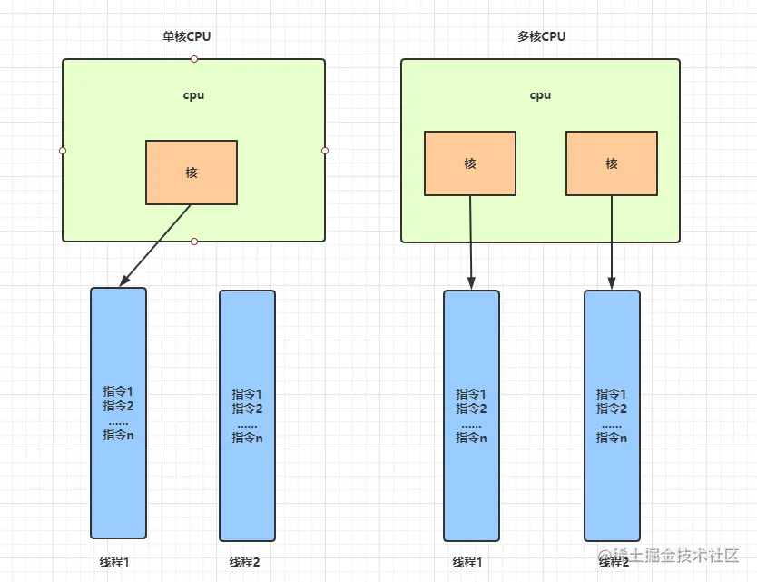
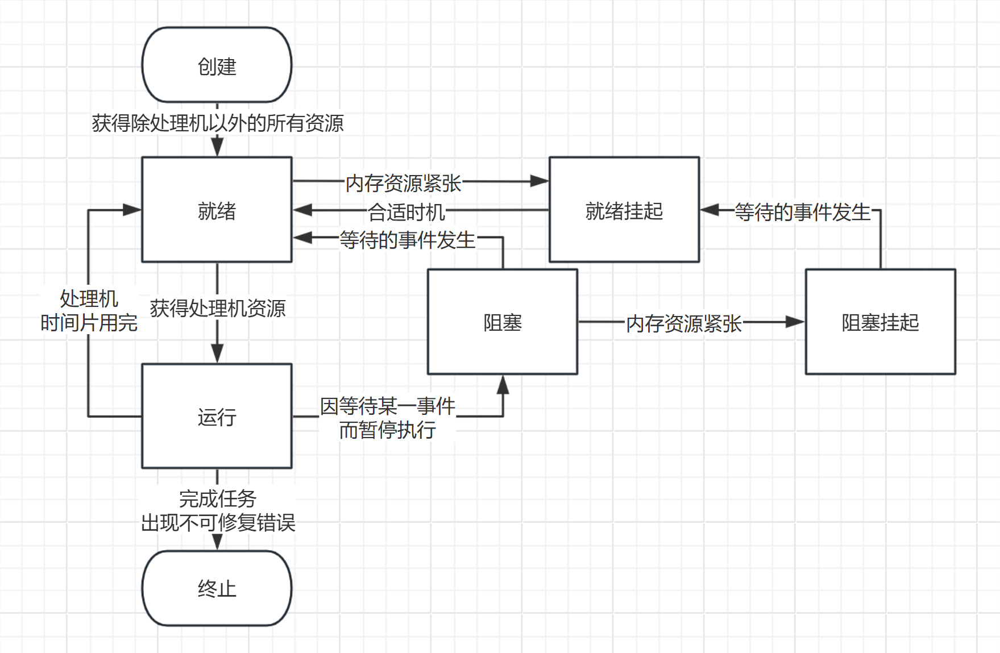
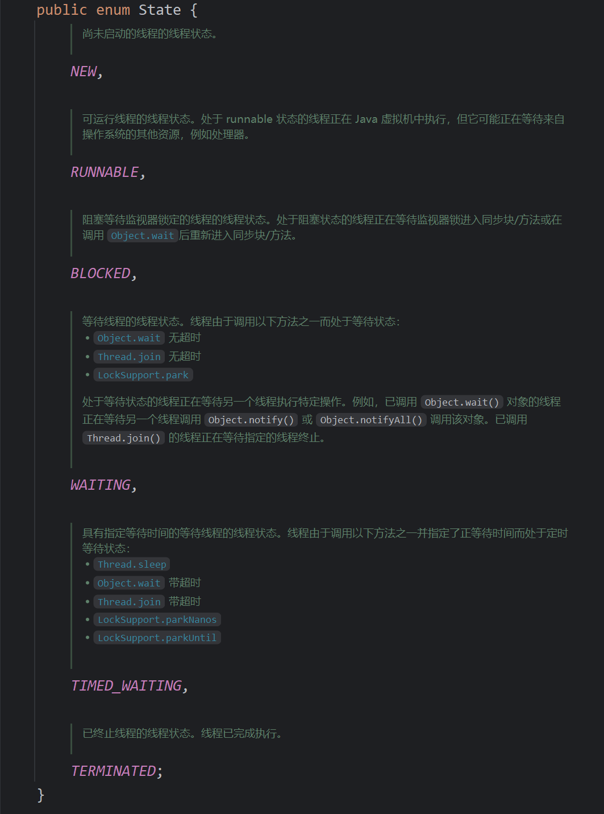
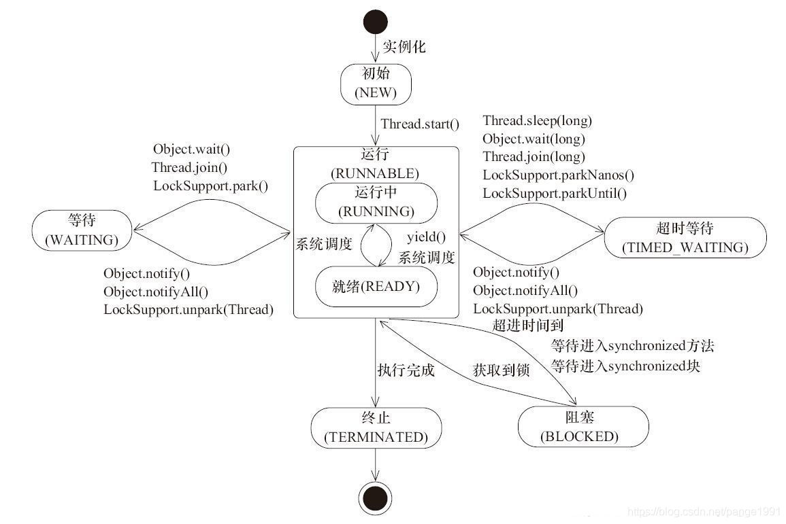
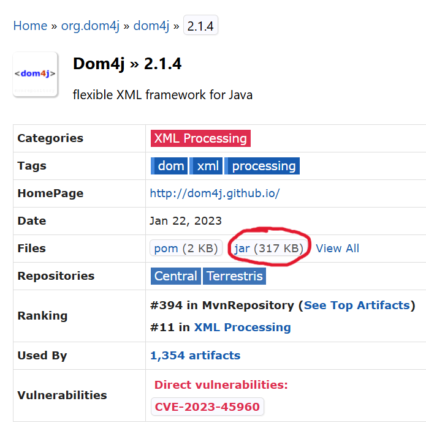

# 课时5

> 本课时是我们这次授课中 JavaSE 的最后一节了，大家加油！！！本次授课的重点在于多线程，其前置知识大家可能平时没了解，会有一点难，希望大家课下搜索资料深刻理解这些概念，这对学习Java多线程是必要的。那我们就开始吧！！！


## 一、多线程

刚看到“多线程”，大家可能会有很多疑惑。

* 什么是多线程？
* 何时需要多线程？
* 怎么进行多线程编程？

带有问题，目的性的学习会让大家记的更牢，更深刻。先让我们来了解一些非常**重要**的前置计算机知识吧。


### 1.1 前置知识


#### 1.1.1 进程与线程

* 进程：是程序在计算机中的一次执行过程，是操作系统进行**资源分配**的基本单位。打开任务管理器就能看到许多进程。

  * 程序由指令和数据组成，但这些指令要运行，数据要读写，就必须将指令加载至 CPU，数据加载至内存。在指令运行过程中还需要用到磁盘、网络等设备。进程就是用来加载指令、管理内存、管理 IO 的。

  * 当一个程序被运行，从磁盘加载这个程序的代码至内存，这时就开启了一个进程。

  * 进程就可以视为程序的一个实例。大部分程序可以同时运行多个实例进程（例如QQ、记事本等），也有的程序只能启动一个实例进程（例如QQ音乐、飞书等）

* 线程：是进程内部的一条执行路径，是进程的一个执行单元，它是比进程更小的能够独立运行的基本单位。

  * 一个进程可以包含多个线程，这些线程共享进程的地址空间、数据段、代码段以及其他资源，如已打开的文件、网络连接等。

  * 一个线程就是一个指令流，将指令流中的一条条指令以一定的顺序交给 CPU 执行。

* 对比

  * 进程是**资源分配**的最小单位，线程是**调度**的最小单位

  * 进程间通信较为复杂

  	* 同一台计算机的进程通信称为 `IPC`（Inter-process communication）

  	* 不同计算机之间的进程通信，需要通过网络，并遵守共同的协议，例如 HTTP

  * 线程通信相对简单，因为它们共享进程内的内存，一个例子是多个线程可以访问同一个共享变量

  * 线程更轻量，线程上下文切换成本一般上要比进程上下文切换低


#### 1.1.2 并发与并行

* 并发：指在**一段时间内**，多个任务交替执行，宏观上看起来像是同时进行。
	* 单核CPU下，线程是串行执行的。操作系统中有一个组件叫做任务调度器，将 CPU 的时间片（windows下时间片最小约为 15 毫秒）分给不同的程序使用，只是由于 CPU 在线程间（时间片很短）的切换非常快，人类感觉是同时运行的 。
	* 总结： 微观串行，宏观并行。

* 并行：指在**同一时刻**，多个任务真正地同时执行。
	* 多核CPU下，每个核都可以调度运行线程，这时线程可以是并行的。




#### 1.1.3 同步与异步

* 同步：一种按顺序执行任务的方式。在同步操作中，一个任务必须等待前一个任务完成后才能开始。就好像是一条流水线，每个环节都要等待前一个环节完成才能运作。这种方式使得程序的执行流程比较直观，易于理解和调试。
* 异步：一种允许任务不按照顺序执行的方式。当一个任务发起一个异步操作后，它不会等待这个操作完成，而是可以继续执行其他任务。当异步操作完成后，会通过某种方式（如回调函数、事件通知等）通知发起者操作已经完成。


#### 1.1.4 什么是多线程？

多线程是指在一个程序中同时运行多个线程来执行不同的任务，这些任务也可能是为了完成一个更大的任务。这些线程可以并发或并行地执行，从而提高程序的执行效率和资源利用率，并且能够让程序同时处理多个任务。


#### 1.1.5 何时需要多线程？

多线程的使用可以带来多方面的好处，包括提高程序的性能、提高资源利用率以及提升响应性等。以下是一些常见的场景，其中使用多线程是有益的：

1. **提高性能**：
	- **并行处理**：当程序需要执行多个**可以并行处理的任务**时，使用多线程可以显著减少总体执行时间。
	- **计算密集型任务**：对于计算密集型任务，多线程可以利用多核处理器的优势，提高计算效率。
2. **改善响应性**：
	- **用户界面**：在图形用户界面（GUI）程序中，使用多线程可以**防止界面在执行长时间运行的任务时冻结**，从而提高用户体验。
	- **网络服务**：对于Web服务器和网络应用，多线程可以同时处理多个客户端请求，提高服务的响应速度和吞吐量。
3. **资源利用率**：
	- **I/O密集型任务**：对于I/O密集型任务（如文件读写、网络通信等），多线程可以避免程序在等待I/O操作完成时闲置，从而提高CPU和I/O资源的利用率。
4. **异步处理**：
	- **非阻塞操作**：在需要非阻塞I/O操作的场景下，多线程可以使得程序在等待I/O操作完成的同时继续执行其他任务。


#### 1.1.6 线程状态


##### 1.1.6.1 操作系统层面（课下自行了解）

* 创建：线程**正在被创建**，操作系统为线程**分配资源**、**初始化`TCB`（Thread Control Block，线程控制块）**
* 就绪：线程已获得**除处理机以外的所有必要资源**，具备了运行的条件，只等待分配处理机资源

* 运行：线程获得处理机资源，正在执行其程序代码

* 阻塞：线程因**等待某一事件**而暂停执行

* 就绪挂起：线程被挂起（从内存移到外存），但一旦有机会被调入内存执行，就可以立即进入就绪状态。挂起就绪状态通常是由于系统内存资源紧张或其他原因导致进程被暂时移出内存。

* 阻塞挂起：线程被挂起且处于**阻塞状态**，等待某个事件的发生。当**事件发生**时，线程会先转换到**挂起就绪状态**，然后在合适的时候再被调入内存进入**就绪状态**。
* 终止：线程正在**从系统中撤销**，操作系统会回收进程拥有的资源、销毁`TCB`
	* 线程**完成任务**或者因**出现不可修复错误**而被操作系统终止




##### 1.1.6.2 `Java API` 层面（现不用太关注其中的方法）

* New（新建 ）：**new**出一个线程对象后，该线程对象就处于新建状态，并保持这个状态到程序 **start()** 这个线程。
* Runnable：当调用线程对象的`start()`方法后，线程进入此状态。
  * 此状态涵盖了**操作系统**层面的【就绪状态】【运行状态】和【阻塞状态】(由于`BIO`导致的线程阻塞，在 Java 里无法区分，仍然认为是可运行)
* Blocked（阻塞）：线程在某些情况下会暂停执行，进入阻塞状态
  * 例如：等待获取锁、等待 I/O 操作完成
* Waiting（无时限等待）：在代码层面主动使线程进入等待状态。
* Timed Waiting（有时限等待）：这是一种特殊的等待状态，线程在等待一段时间后会自动唤醒。通常是因为调用了带时间参数的等待方法。
* Terminated（死亡）：当线程执行完`run()`方法中的所有任务，或者因为出现未捕获的异常导致线程提前结束，线程就进入终止状态。此时线程的生命周期结束，不能再重新启动。






### 1.2 API

了解上面的前置知识后，下面我们将介绍如何在Java中进行多线程编程。


#### 1.2.1 创建

刚刚我们讲过，线程就是一条指令流，因此我们第一步要做的就是实现**任务**，然后将任务交给线程执行。

主要有以下三种方式实现任务：

* 继承`Thread`类：重写`run`方法来定义线程的执行逻辑（不推荐）
* 实现`Runnable`接口：实现`run`方法来定义线程的执行内容
* 实现`Callable`接口：实现`call`方法（可以有返回值并且可以抛出异常），与`FutureTask`搭配使用


##### 1.2.1.1 继承`Thread`类

```JAVA
public class ThreadDemo extends Thread{

    public static void main(String[] args) {
        // 直接实例化自定义的ThreadDemo对象
        ThreadDemo threadDemo = new ThreadDemo();
        // 启动线程，进入就绪状态，等待cpu调度
        threadDemo.start();
    }

    @Override
    public void run() {
        System.out.println("执行Thread实现的线程任务");
    }

}
```

* **特点**
	* **简单直接**：对于简单的线程任务，这种方式很直观。只需要关注`run`方法中的任务逻辑即可。
	* **局限性**：Java 不支持多继承，如果一个类继承了`Thread`类，就不能再继承其他类。这可能会**限制类的扩展性**。而且，当需要多个线程共享数据时，通过继承`Thread`类来实现可能会使代码结构不够清晰，需要借助类的成员变量等方式来共享数据。


##### 1.2.1.2 实现`Runnable`接口

```JAVA
public class RunnableDemo implements Runnable {

    public static void main(String[] args) {

        // 实例化RunnableDemo任务对象
        RunnableDemo runnableDemo = new RunnableDemo();
        // 将任务交由线程执行
        Thread thread = new Thread(runnableDemo);
        thread.start();

        try {
            // 线程进入有时限等待状态
            Thread.sleep(1000); // 单位:mm(毫秒)，可以选择使用下面的方法
            // TimeUnit.SECONDS.sleep(1);
        } catch (InterruptedException e) {
            throw new RuntimeException(e);
        }

        thread = new Thread(() -> System.out.println("执行lambda表达式实现runnable接口定义的任务"));
        thread.start();
    }

    @Override
    public void run() {
        System.out.println("执行Runnable实现的线程任务");
    }

}
```

* 特点
	- **灵活性高**：符合面向对象的 “组合优于继承” 原则。实现`Runnable`接口的类可以方便地被多个线程共享，只要将同一个`Runnable`对象传递给不同的`Thread`对象即可。这样在多线程共享数据和代码逻辑时更加方便。
	- **可扩展性强**：由于没有继承`Thread`类，该类可以自由地继承其他类来扩展功能。


##### 1.2.1.3 实现`Callable`接口

```JAVA
//                                   定义返回值的类型
public class CallableDemo implements Callable<String> {

    public static void main(String[] args) {
        // 实例化CallableDemo回调任务对象
        CallableDemo callableDemo = new CallableDemo();
        // 将回调任务对象交由未来任务对象进行管理
        FutureTask<String> futureTask = new FutureTask<>(callableDemo);
        // 将未来任务交由线程执行
        Thread thread = new Thread(futureTask);
        thread.start();
        try {
            TimeUnit.SECONDS.sleep(1);
            System.out.println("主线程苏醒");
            // 获取异步任务的结果，如果异步任务还未完成，将阻塞主线程（执行本条指令的线程）
            System.out.println(futureTask.get());
        } catch (InterruptedException | ExecutionException e) { // 处理捕获执行异步任务可能发生的异常
            // 这里并未处理，而是继续往上抛
            throw new RuntimeException(e);
        }
    }

    @Override
    public String call() throws Exception {
        System.out.println("执行Callable实现的线程任务");
        try {
            Thread.sleep(2000);
        } catch (InterruptedException e) {
            throw new RuntimeException(e);
        }
        return "Callable接口返回的结果";
    }

}
```

* 特点
	- **有返回值**：与`Runnable`和继承`Thread`类的方式不同，`Callable`接口的`call`方法可以返回结果，这使得它在需要获取线程执行后的计算结果等场景中非常有用。
	- **可处理异常**：`call`方法可以抛出异常，这使得在复杂的计算任务或可能出现错误的任务场景中，能够更好地处理异常情况。


#### 1.2.2 Thread类的方法

任务终究是由线程执行，因此我们还需学习Thread类的成员方法。

由于方法很多且有些现在你们可能不容易理解，因此我只挑一些基本的方法进行讲解。


##### 1.2.2.1 run ()

- **功能**：线程的执行体，包含了线程要执行的任务代码
	- 当直接调用`run`方法时，主线程（执行该执行的线程）会按照顺序执行方法中的代码，不会开启新的线程。

```java
class MyThread extends Thread {
    public void run() {
        System.out.println("在当前线程中执行run方法");
    }
}
public class Main {
    public static void main(String[] args) {
        MyThread myThread = new MyThread();
        myThread.run();
    }
}
```


##### 1.2.2.2 start ()

* 功能：用于启动线程。当调用`start()`方法时，线程会从新建状态进入就绪状态，等待 CPU 资源分配，一旦获取 CPU 时间片就会执行`run()`方法中的代码。需要注意的是，不能多次启动同一个线程，否则会抛出`IllegalThreadStateException`异常。


##### 1.2.2.3 join ()

* **功能**：用于等待调用该方法的线程执行完毕。如果在一个线程中调用了另一个线程的`join()`方法，当前线程会被阻塞，直到被调用的线程执行结束
	* 可以传入一个时间参数，表示最多等待的时间，超过这个时间如果线程还没有结束，当前线程会继续执行。

```java
public class JoinDemo extends Thread{
    public static void main(String[] args) {
        JoinDemo thread = new JoinDemo();
        thread.start();
        try {
            thread.join();
        } catch (InterruptedException e) {
            throw new RuntimeException(e);
        }
        System.out.println("主线程在子线程结束后执行");
    }
    @Override
    public void run() {
        try {
            System.out.println("子线程开始执行");
            Thread.sleep(2000);
            System.out.println("子线程执行结束");
        } catch (InterruptedException e) {
            e.printStackTrace();
        }
    }
}
```


##### 1.2.2.4 sleep ()

* **功能**：使当前线程暂停执行一段时间，时间单位是毫秒。线程在调用`sleep()`方法后会进入计时等待状态，在这段时间内不会占用 CPU 资源。当睡眠时间结束后，线程会重新进入就绪状态，等待 CPU 调度。该方法可能会抛出`InterruptedException`异常，例如当线程在睡眠期间被其他线程中断时。


##### 1.2.2.5 yield ()

- **功能**：暂停当前正在执行的线程，将 CPU 资源让给其他就绪状态的线程。但是，`yield()`方法只是一个提示，操作系统可能不会理会这个请求，当前线程可能会继续执行。该方法没有参数，也不会抛出异常。

```JAVA
public class YieldDemo {
    public static void main(String[] args) {
        MyThread1 myThread1 = new MyThread1();
        MyThread2 myThread2 = new MyThread2();
        myThread1.start();
        myThread2.start();
    }
}

class MyThread1 extends Thread {
    public void run() {
        for (int i = 0; i < 5; i++) {
            System.out.println("线程1执行: " + i);
            if (i == 2) {
                Thread.yield();
            }
        }
    }
}

class MyThread2 extends Thread {
    public void run() {
        for (int i = 0; i < 5; i++) {
            System.out.println("       线程2执行: " + i);
        }
    }
}
```


##### 1.2.2.6 `isAlive()`

- **功能**：用于判断线程是否还存活。线程在`start()`方法被调用后开始执行，直到`run()`方法执行完毕或者出现未捕获的异常导致线程终止，这个过程中`isAlive()`方法会返回`true`，否则返回`false`。


##### 1.2.2.7 `setDaemon()`

* **守护(Daemon)线程**：一种为其他线程（用户线程）服务的线程，它的主要作用是在后台为其他线程提供支持。

* **功能**：用于将线程设置为守护线程（默认为为用户线程）
* **作用原理**：守护线程的生命周期依赖于用户线程。当所有的用户线程都结束时，守护线程会自动终止，而不管守护线程本身的任务是否完成。这就好像守护线程是在为用户线程 “保驾护航”，一旦用户线程都完成了任务，守护线程也就没有存在的必要了。

```JAVA
public class DaemonDemo {
    public static void main(String[] args) {
        MyDaemonThread daemonThread = new MyDaemonThread();
        // 将线程设置为守护线程
        daemonThread.setDaemon(true);
        daemonThread.start();
        try {
            Thread.sleep(5000);
            System.out.println("主线程结束");
        } catch (InterruptedException e) {
            e.printStackTrace();
        }
    }
}

class MyDaemonThread extends Thread {
    public void run() {
        while (true) {
            System.out.println("守护线程在运行");
            try {
                Thread.sleep(1000);
            } catch (InterruptedException e) {
                e.printStackTrace();
            }
        }
    }
}
```


##### 1.2.2.8 名称

* 线程默认有一个名称，主线程的名称是`main`，其他线程的名称是`Thread -` 加上一个数字编号
	* 通过这两个方法可以自定义线程的名称，方便在多线程编程中对线程进行识别和管理。

* `getName()`：获取线程的名称
* `setName()`：设置线程的名称


##### 1.2.2.9 优先级

* 优先级的取值范围是 1 - 10，其中 1 为最低优先级，10 为最高优先级，默认优先级是 5
	* 线程优先级只是一个提示，操作系统可能不会完全按照设定的优先级来调度线程。

* `getPriority()`：获取线程的优先级
* `setPriority(int newPriority)`：设置线程的优先级


##### 1.2.2.10 其余方法

* `Thread.currentThread()`：用于返回当前正在执行的线程对象
* `Thread.interrupted()`：返回当前线程的打断标记，并置为false
* `isInterrupt()`：返回打断标记
* `interrupt()`：打断线程的运行（代码中需自行处理后事）
	- runnable：打断变量设置为true
	- blocked：**抛出异常**，打断变量设置为false（需要手动捕获）


### 1.3 线程安全

多线程虽然有诸多好处，但也存在着一些很严重的安全问题。下面我会讲解为什么会存在安全问题以及如何解决。


#### 1.3.1 线程安全问题

指在**多线程环境下**，由于多个线程并发访问**共享资源**（如共享变量、共享对象）或执行相互关联的操作，导致程序出现不符合预期的结果、数据不一致、程序崩溃等错误的情况。简单来说，就是多个线程同时操作某些东西，结果却乱了套。

大家先看下以下代码，可以copy进idea内运行，看下有无问题

```java
public class ThreadSecurity {

    public static void main(String[] args) throws InterruptedException {
        // 计数器实例
        Counter counter = new Counter();

        // t1线程让计数器自增10000次
        Thread t1 = new Thread(() -> {
            for (int i = 0; i < 10000; i++) counter.increment();
        });
        
        // t2线程让计数器自增10000次
        Thread t2 = new Thread(() -> {
            for (int i = 0; i < 10000; i++) counter.increment();
        });

        t1.start();
        t2.start();
        // 等待t1、t2执行完
        t1.join();
        t2.join();
        System.out.println(counter.getCount());
    }

    // 计数器类
    static class Counter {

        private int count;

        public void increment() {
            count++;
        }

        public int getCount() {
            return count;
        }
    }
}
```

上面的多线程编程就发生了线程安全问题

* 为什么会发生？

	* **原子性问题**
		* 一个操作如果是**原子操作**，那么它在执行过程中**不会被其他线程中断**。然而，很多操作在计算机中并不是原子操作。例如，对于一个共享变量的 “自增（++）” 操作，在机器语言层面可能包含多个步骤（读取变量值、加 1、写回新值）。如果这些步骤在执行过程中被其他线程打断，就会出现原子性问题，导致数据错误。
	* **可见性问题**
		* 每个线程都有自己的工作内存（可以看作是 CPU 缓存等）。当一个线程修改了共享变量的值后，这个修改可能不会立即被其他线程看到。例如，线程 A 修改了一个共享变量的值，但这个新值可能还存储在 A 的工作内存中，没有及时更新到主内存。此时，线程 B 访问这个共享变量时，可能会从主内存或者自己的工作内存中读取到旧的值，从而导致数据不一致。

	* **有序性问题**
		- 为了提高性能，编译器和处理器可能会对指令进行重新排序。在单线程环境下，这种重排序通常不会影响程序的最终结果。但在多线程环境中，就可能导致问题。例如，有两个线程 A 和 B，共享变量 x 和 y。线程 A 先对 x 赋值，然后对 y 赋值；线程 B 先读取 y 的值，然后读取 x 的值。由于指令重排序，线程 B 读取到的值可能不符合预期，导致程序出现错误。


#### 1.3.2 解决

在学习如何解决之前，我们先来了解一些概念

* 临界资源：一段时间内只允许一个进程/线程访问的**公共**资源
	* 上面示例中的计数器counter就是临界资源
* 临界区：存在对**共享资源的多线程访问（读写操作）**的**代码块**
	* 上面示例中计数器自增方法中的`count++;`就是临界区

在进行多线程编程时，我们要弄清哪些资源是临界资源，哪里是临界区，才好对症下药。

而要解决线程安全问题就是要对**临界资源**实现原子性、可见性和有序性。

这里我只介绍两种常用的使用锁的方法

* 悲观锁-互斥

  * `Synchronized`关键字：通过**`JVM`自动**获取与释放锁来解决原子性、可见性和有序性问题
  * `Lock`锁接口的实现类：通过**手动**获取与释放锁来解决原子性、可见性和有序性问题
* 课下自行了解
	* `Volatile`关键字：解决了可见性和有序性，未解决原子性
	* 乐观锁（`CAS`，`compareAndSet`）：原子类、线程安全集合
	* 不可变类


##### 1.3.2.1 Synchronized

* **方法级别同步**：声明中使用`synchronized`关键字，**自动指定锁对象**。当一个线程访问一个对象的`synchronized`方法时，会获取指定对象的锁，其他线程如果也想进入这个代码块，必须等待锁被释放。

	* 锁对象：
		* 静态方法：类的字节码对象（类名.class）
		* 成员方法：实例本身

	```java
	        public synchronized void increment() {
	            count++;
	        }
	```

	* 上面的代码中，我们声明`increment()`时，添加了synchronized关键字，将整个方法给锁住了，并自动指定counter对象本身为锁对象

* **代码块级别同步**：使用`synchronized`关键字包裹一段代码块，并**手动指定一个对象作为锁**。

	* 锁对象的手动指定建议遵循自动指定的规范

	```JAVA
	        public void increment() {
	            // 指定计数器counter本身为锁对象
	            synchronized (this) {
	                count++;
	            }
	        }
	```

	* 上面的代码中，我们将临界区`count++;`放进了synchronized代码块中，就实现了线程间的同步，避免了同时访问造成的安全问题。
	
* 值得注意的是尽量保证同步代码块只包含临界区，避免不必要的阻塞


##### 1.3.2.2 lock锁

* 相比`synchronized`关键字，`Lock`接口提供了更灵活的锁机制。例如，可以实现可中断的锁获取、尝试非阻塞地获取锁、实现公平锁等操作。

* 这里演示`ReentrantLock`可重入锁的基本使用

	```JAVA
	    static class Counter {
	
	        private int count;
	        private ReentrantLock lock = new ReentrantLock();
	
	        public void increment() {
	            lock.lock();
	            try { // 临界区
	                count++;
	            } finally { // 避免发生异常导致锁未释放
	                lock.unlock();
	            }
	        }
	
	        public int getCount() {
	            return count;
	        }
	    }
	```


#### 1.3.3 使用锁会出现的问题

使用锁实现线程同步可以很好的解决问题，但也随之出现了新的问题，我这里只列出其概念，大家课下可自行了解。

* 死锁：多个进程或线程在执行过程中，因**争夺资源**而造成的一种**互相等待**的现象，若无外力作用，它们都将无法推进下去。
* 活锁：多个进程或线程**不断地改变**它们的**状态**以**响应**对方的**动作**，导致没有一个进程或线程能够继续执行下去，但它们的**状态不断地在改变**，不像死锁那样处于**僵持状态**。
* 饥饿：一个进程或线程**长时间无法获得所需资源**，从而导致其无法正常执行。


### 1.4 [线程池]([Java中的线程池（如果想知道Java中有关线程池的知识，那么只看这一篇就足够了！）-CSDN博客](https://blog.csdn.net/2302_80198073/article/details/143582322))

由于频繁地创建和销毁线程会导致大量的资源分配和回收操作，消耗 CPU 时间和内存资源，因此我们需要一个线程池预先创建并维护了一组线程。当有任务需要执行时，将任务提交到线程池的任务队列，任务完成后线程可以被其他任务复用。这样就避免了频繁地创建和销毁线程，显著减少了资源开销。除此之外线程池还有如下好处：

* **提高响应速度**：任务到达时，可以不需要等待线程的创建立即执行
*  **提高线程的可管理性**：使用线程池能够统一的分配、调优和监控

下面我们介绍在Java中如何创建和使用线程池


#### 1.4.1 构造方法

```JAVA
public ThreadPoolExecutor(int corePoolSize,                 // 核心线程数
 						  int maximumPoolSize,				// 最大线程数
 						  long keepAliveTime,				// 生存时间 - 针对救急线程
 						  TimeUnit unit,					// 时间单位
 						  BlockingQueue<Runnable> workQueue,// 阻塞队列
 						  ThreadFactory threadFactory,		// 线程工厂（线程命名）
 						  RejectedExecutionHandler handler);// 拒绝策略
```

* **核心线程数（corePoolSize）**
	- 核心线程在创建线程池后就会被预创建，并且即使处于空闲状态也不会被销毁。这些线程是线程池的基本执行力量，用于处理任务。
* **最大线程数（maximumPoolSize）**
	- 线程池允许创建的最大线程数量。它包括**核心线程**和**临时线程**（当任务过多，核心线程处理不过来时创建的线程）。
* **线程存活时间（keepAliveTime）和时间单位（unit）**
	- 当线程池中的线程数量超过核心线程数时，多余的线程（临时线程）在空闲状态下的存活时间。时间单位用于指定`keepAliveTime`的单位，如秒、毫秒等
* **任务队列（workQueue）**
	- 用于存储等待执行任务的队列。线程池中的线程会从这个队列中获取任务并执行。
* **线程工厂（threadFactory）**
	- 用于创建新线程的工厂对象。通过线程工厂可以定制线程的创建过程，如设置线程的名称、优先级、是否为守护线程等。
* **拒绝策略（handler）**
	- 当线程池无法接收新任务（如线程池已经关闭或者任务队列已满并且线程数已经达到最大线程数）时，用于处理新任务的策略。
	- Java 提供了几种默认的拒绝策略
		- `ThreadPoolExecutor.AbortPolicy`：抛出异常，默认策略
		- `ThreadPoolExecutor.CallerRunsPolicy`：由提交任务的线程来执行任务
		- `ThreadPoolExecutor.DiscardPolicy`：直接丢弃任务
		- `ThreadPoolExecutor.DiscardOldestPolicy`：丢弃任务队列中最老的任务，然后尝试重新提交新任务


#### 1.4.2 使用

* `void execute(Runnable command)`：对于实现了`Runnable`接口的任务，可以使用线程池的`execute`方法来提交任务

	```JAVA
	    public static void  main(String[] args) {
	        pool.execute(()-> System.out.println("执行无返回值任务"));
	    }
	```

* `<T> Future<T> submit(Callable<T> task)`：对于需要获取任务执行结果的情况，可以使用`submit`方法

	* 异常处理：通过`Future`获取结果时可能会抛出`ExecutionException`和`InterruptedException`，需要进行适当的处理

	```JAVA
	    public static void  main(String[] args) {
	        Future<String> future = pool.submit(() -> {
	            System.out.println("执行有返回值任务");
	            Thread.sleep(1000);
	            return "返回任务结果";
	        });
	        try {
	            System.out.println(future.get());
	        } catch (InterruptedException | ExecutionException e) {
	            throw new RuntimeException(e);
	        }
	    }
	```

* `shutdown()`：调用`shutdown`方法后，线程池不会再接受新的任务，但会继续执行已经提交的任务，直到所有任务完成后才真正关闭

* `shutdownNow()`：调用`shutdownNow`方法会尝试立即停止所有正在执行的任务，并返回尚未开始执行的任务列表。它会通过中断线程的方式来停止任务执行，但并不能保证任务一定会停止。


>本次授课只是粗浅的介绍了Java中的多线程的基本使用，不过对于初学者，这些东西也够用了，等学完框架，可以再回来补补。


## 二、I/O

> 相比多线程，I/O就轻松多了。不过这里面涉及很多类，我这里只简要介绍其基本使用，大家课后自行了解。


### 2.1 概念

首先让我们先来了解一些基本概念：

* I/O 流（Input/Output Stream）是在计算机编程中用于处理**输入**和**输出**操作的一种抽象概念。数据传输过程类似于水流，因此称为 IO 流。

- 输入流（Input Stream）
	- 用于从外部数据源（如文件、网络连接、键盘等）读取数据到程序中。它就像是一条管道，数据从数据源通过这个管道流入程序的内存空间。
	- 例如，当你在控制台（通过键盘）输入一些字符，程序通过输入流读取这些字符，以便后续处理。
- 输出流（Output Stream）
	- 用于将程序中的数据发送到外部目的地（如文件、网络连接、显示器等）。同样类比为管道，程序中的数据通过这个管道流出到外部设备。
	- 比如，当你使用`print`函数在控制台输出信息时，实际上是通过输出流将数据发送到显示器上显示出来。

- 字节流（Byte Stream）
	- 字节流以字节（8 位二进制数据）为基本单位进行数据的传输。字节流可以处理任何类型的数据，因为所有的数据在计算机底层都是以字节形式存储的。
	- 例如，在读取一个二进制文件（如图片、视频等）时，字节流能够很好地完成任务
- 字符流（Character Stream）
	- 字符流以字符为基本单位进行数据传输。字符流主要用于处理文本数据，它考虑了**字符编码**等问题。
	- 比如，在读取一个纯文本文件并进行字符处理时，字符流比较方便，因为它会按照字符编码（如 `UTF-8`、`GBK`等）正确地解析字符
	- 编码（Encoding）：将信息从一种形式或格式转换为另一种形式的过程。
		- 由于计算机底层用二进制存储数据，因此需要我们用**字符集**将字符编码成二进制形式。
		- 字符集：字符的集合，规定了某些字符，并且为每个字符分配了一个唯一的编号（二进制）。
	- 译码（Decoding）
		- 译码是编码的逆过程，它将经过编码后的信息恢复为原始的、人类可理解的形式或者计算机可以进一步处理的形式。


### 2.2 `API`

在了解了基础概念后，我们就可以学习如何在Java中进行I/O操作了。


#### 2.2.1 体系结构

由于Java中与I/O相关的`API`众多，我们先来了解一下体系结构。

Java IO 流中的 40 多个类都是从如下 4 个抽象类基类中派生出来的。

- `InputStream`/`Reader`: 所有的输入流的**基类**，前者是字节输入流，后者是字符输入流。
- `OutputStream`/`Writer`: 所有输出流的**基类**，前者是字节输出流，后者是字符输出流。


#### 2.2.2 字节流


##### 2.2.2.1 `InputStream`

`InputStream`用于从源头（通常是文件）读取数据（字节信息）到内存中，`java.io.InputStream`**抽象类**是所有字节输入流的父类。

* 常用方法

	- `read()`：返回输入流中下一个字节的数据。返回的值介于 0 到 255 之间。
		- 如果未读取任何字节，则代码返回 `-1` ，表示文件结束。
	- `read(byte b[ ])` : 从输入流中读取一些字节存储到数组 `b` 中。
		- 如果数组 `b` 的长度为零，则不读取。
		- 如果没有可用字节读取，返回 `-1`。
		- 如果有可用字节读取，则最多读取的字节数最多等于 `b.length` ， 返回读取的字节数。

	- `read(byte b[], int off, int len)`：在`read(byte b[ ])` 方法的基础上增加了 `off` 参数（偏移量）和 `len` 参数（要读取的最大字节数）。

	- `skip(long n)`：忽略输入流中的 n 个字节 ,返回实际忽略的字节数。

	- `available()`：返回输入流中可以读取的字节数。

	- `close()`：关闭输入流释放相关的系统资源。

* 从 Java 9 开始，`InputStream` 新增加了多个实用的方法：

	- `readAllBytes()`：读取输入流中的所有字节，返回字节数组。

	- `readNBytes(byte[] b, int off, int len)`：阻塞直到读取 `len` 个字节。

	- `transferTo(OutputStream out)`：将所有字节从一个输入流传递到一个输出流

	

##### 2.2.2.2 `OutPutStream`

`OutputStream`用于将数据（字节信息）写入到目的地（通常是文件），`java.io.OutputStream`抽象类是所有字节输出流的父类。

* 常用方法
	* `write(int b)`：将特定字节写入输出流。
	* `write(byte b[ ])` : 将数组`b` 写入到输出流，等价于 `write(b, 0, b.length)` 。
	* `write(byte[] b, int off, int len)` : 在`write(byte b[ ])` 方法的基础上增加了 `off` 参数（偏移量）和 `len` 参数（要读取的最大字节数）。
	* `flush()`：刷新此输出流并强制写出所有缓冲的输出字节。
	* `close()`：关闭输出流释放相关的系统资源。


示例：我这里采用`FileInputStream` ，这是一个比较常用的字节输入流对象，通过指定文件路径，读取数据。

```JAVA
    public static void main(String[] args) {
        try {
            // 采用utf-8字符集将字符编码成字节
            byte[] bytes = "Let's study Java!\n".getBytes(StandardCharsets.UTF_8);
            // 实例化test.txt文件的输出流
            OutputStream os = new FileOutputStream("lesson5/io/byte.txt");
            for (byte b : bytes) {
                // 一次写入一个字节
                os.write(b);
            }
            // 不用了务必要关闭流
            os.close();

            // 实例化test.txt文件的输入流
            InputStream is1 = new FileInputStream("lesson5/io/byte.txt");
            int content; // 存储读取的一个字节
            while ((content = is1.read()) != -1) {
                System.out.print((char) content);
            }
            System.out.println();

            InputStream is2 = new FileInputStream("lesson5/io/byte.txt");
            // 声明字节数组
            byte[] outputBytes = new byte[1024];
            // 记录偏移量和读取的字节数
            int offset = 0, count;
            while ((count = is2.read(outputBytes, offset, 3)) != -1) { // 还有字节就继续读
                System.out.println(new String(outputBytes, offset, count));
                offset += count;
            }

            // 不用了务必要关闭流
            is1.close();
            is2.close();
        } catch (IOException e) {
            e.printStackTrace();
        }
    }
```


#### 2.2.3 字符流


##### 2.2.3.1 Reader

`Reader`用于从源头（通常是文件）读取数据（字符信息）到内存中，`java.io.Reader`抽象类是所有字符输入流的父类。

* 常用方法
	* `read()` : 从输入流读取一个字符。
	* `read(char[] cbuf)` : 从输入流中读取一些字符，并将它们存储到字符数组 `cbuf`中。
	* `read(char[] cbuf, int off, int len)`：在`read(char[] cbuf)` 方法的基础上增加了 `off` 参数（偏移量）和 `len` 参数（要读取的最大字符数）。
	* `skip(long n)`：忽略输入流中的 n 个字符 ,返回实际忽略的字符数。
	* `close()` : 关闭输入流并释放相关的系统资源。


##### 2.2.3.2 Writer

`Writer`用于将数据（字符信息）写入到目的地（通常是文件），`java.io.Writer`抽象类是所有字符输出流的父类。

* 常用方法
	* `write(int c)` : 写入单个字符。
	* `write(char[] cbuf)`：写入字符数组 `cbuf`。
	* `write(char[] cbuf, int off, int len)`：在`write(char[] cbuf)` 方法的基础上增加了 `off` 参数（偏移量）和 `len` 参数（要读取的最大字符数）
	* `write(String str)`：写入字符串，等价于 `write(str, 0, str.length())` 。
	* `write(String str, int off, int len)`：在`write(String str)` 方法的基础上增加了 `off` 参数（偏移量）和 `len` 参数（要读取的最大字符数）。
	* `append(CharSequence csq)`：将指定的字符序列附加到指定的 `Writer` 对象并返回该 `Writer` 对象，这使得可以进行链式调用。
	* `append(char c)`：将指定的字符附加到指定的 `Writer` 对象并返回该 `Writer` 对象，这使得可以进行链式调用。
	* `flush()`：刷新此输出流并强制写出所有缓冲的输出字符。
	* `close()`:关闭输出流释放相关的系统资源。


**示例**

```JAVA
    public static void main(String[] args) {
        // 在此处声明流对象，会自动关闭，无需手动关闭
        try (Writer writer = new FileWriter("lesson5/io/character.txt");
             Reader reader = new FileReader("lesson5/io/character.txt")) {
            String s = "让我们学习 Java！\n";
            writer.write(s);
            // 刷新此输出流并强制写出所有缓冲的输出字符
            // 要是不刷新，结果会有什么不一样呢？
            writer.flush();

            int content;
            while((content = reader.read()) != -1) {
                System.out.print((char)content);
            }

        } catch (IOException e) {
            e.printStackTrace();
        }
    }
```


##### 2.2.3.3 缓冲流

IO 操作是很消耗性能的，缓冲流将数据加载至缓冲区，一次性读取/写入多个字节，从而避免频繁的 IO 操作，提高流的传输效率。

大家课下自行了解。


## 三、反射


### 3.1 简介

* 概述

	- Java反射机制的核心是在程序**运行时**动态加载类并获取类的详细信息，从而操作类或对象的属性和方法。本质是 `JVM`得到class对象之后，再通过class对象进行反编译，从而获取对象的各种信息。

	- Java属于先编译再运行的语言，程序中对象的类型在编译期就确定下来了，而当程序在运行时可能需要动态加载某些类，这些类因为之前用不到，所以没有被加载到 `JVM`。通过反射，可以在运行时动态地创建对象并调用其属性，不需要提前在编译期知道运行的对象是谁。

* 用途：

	* 反编译：`.class–>.java`

	* 通过反射机制访问Java对象的属性，方法，构造方法等

	* 当我们在使用 IDE ,比如idea时，当我们输入一个对象或者类，并想调用他的属性和方法是，一按点号，编译器就会自动列出他的属性或者方法，这里就是用到反射。

	* 反射最重要的用途就是开发各种通用框架。比如很多框架（Spring）都是配置化的（比如通过XML文件配置Bean，后面我也会举例），为了保证框架的通用性，他们可能需要根据配置文件加载不同的类或者对象，调用不同的方法，这个时候就必须使用到反射了，运行时动态加载需要的加载的对象。

* 优点：在运行时获得类的各种内容，进行反编译，对于Java这种先编译再运行的语言，能够让我们很方便的创建灵活的代码，这些代码可以在运行时装配，无需在组件之间进行源代码的链接，更加容易实现面向对象。

* 缺点：反射调用方法时可以忽略权限检查，因此可能会**破坏封装性**而导致安全问题。


### 3.2. `API`

Java 的反射 `API `提供了一系列的类和接口来操作 Class 对象。主要的类包括：

- **`java.lang.Class`**：表示类的对象。提供了方法来**获取**类的字段、方法、构造函数等。
- **`java.lang.reflect.Field`**：表示类的字段（属性）。提供了**访问**和**修改**字段的能力。
- **`java.lang.reflect.Method`**：表示类的方法。提供了**调用方法**的能力。
- **`java.lang.reflect.Constructor`**：表示类的构造函数。提供了**创建对象**的能力。

这里说明一下反射`API`的**主要使用顺序**：

1. **获取`Class`对象**：首先获取目标类的 `Class` 对象。
2. **获取类信息**：通过 `Class` 对象，可以获取类的字段、方法、构造函数等信息。
3. **执行操作**：通过反射 `API `可以读取和修改字段的值、调用方法以及创建对象。


#### 3.2.1 Class 类

在 Java 中，每个类在运行时都有一个对应的`Class`对象。这个`Class`对象是反射的核心，它包含了类的==结构信息==。你可以通过它来获取关于这个类的一切信息，这也是它存在的意义。


##### 3.2.1.1 获取

可以通过以下三种方式获取`Class`对象：

* `类名.class`
* `对象.getClass();`
* `Class.forName("全限定名");`
	* 需要传入类的全限定名：`Class.forName("java.util.Date")`可以获取`Date`类的`Class`对象


##### 3.2.1.2 方法

Class字节码类有很多方法，这里只介绍其主要方法：

* 构造方法
	* `getConstructors()`：获取**所有公共**构造函数。
	* `getDeclaredConstructors()`：获取**所有声明**的构造函数，**包括私有构造函数**。
* 字段
	* `getFields()`：获取所有公共字段。
	* `getDeclaredFields()`：获取所有声明的字段，包括私有字段。

- 方法
	- `getMethods()`：获取所有公共方法。
	- `getDeclaredMethods()`：获取所有声明的方法，包括私有方法。
- 其他
	- `getSuperclass()`：获取类的父类。
	- `getInterfaces()`：获取类实现的所有接口。


#### 3.2.2 **`Constructor` 类**

- 主要方法
	- `newInstance(Object... initargs)`：创建一个新实例，使用指定的构造函数参数。
	- `getParameterTypes()`：获取构造函数的参数类型。
	- `getModifiers()`：获取构造函数的修饰符（如 public、private）。


#### 3.2.3  **`Field` 类**

- 主要方法
	- `get(Object obj)`：获取指定对象的字段值。
	- `set(Object obj, Object value)`：设置指定对象的字段值。
	- `getType()`：获取字段的数据类型。
	- `getModifiers()`：获取字段的修饰符（如 public、private）。


#### 3.2.4  **`Method` 类**

- 主要方法
	- `invoke(Object obj, Object... args)`：调用指定对象的方法。
	- `getReturnType()`：获取方法的返回类型。
	- `getParameterTypes()`：获取方法的参数类型。
	- `getModifiers()`：获取方法的修饰符（如 public、private）。


#### 3.2.5 示例

最后来个示例讲解一下吧！

由于示例中用到了 `dom4j`库中的 SAXReader (XML解析器)，因此需要大家先按照下面的步骤导入外部库。

1. 下载：[org.dom4j](https://mvnrepository.com/artifact/org.dom4j/dom4j/2.1.4)

	

2. 导入项目：[在IDEA普通项目中导入jar包](https://blog.csdn.net/drizzletowne/article/details/120932254)


```XML
<?xml version="1.0" encoding="UTF-8" ?>
<Bean>
    <Car>
        <model>Tesla Model Y</model>
        <year>2023</year>
        <class>lesson5.reflect.Car</class>
    </Car>
</Bean>
```

```JAVA
public class Demo {

    public static void main(String[] args) throws Exception {
        // 创建解析器
        SAXReader reader = new SAXReader();
        // 解析xml文档,得到document对象
        Document document = reader.read("lesson5/reflect/Car.xml");
        // 根据document对象获取根节点(这里对应的是Bean)
        Element root = document.getRootElement();
        // 查找根节点下的子节点
        Element bean = root.element("Car");
        // 获得全限定名
        String className = bean.element("class").getText();
        // 获取字节码对象
        Class<?> clazz = Class.forName(className);

        // 创建 Car 对象
        Constructor<?> constructor = clazz.getConstructor(String.class, int.class);
        Object car = constructor.newInstance(
                bean.element("model").getText(),
                Integer.parseInt(bean.element("year").getText()));

        // 访问和修改字段
        Field modelField = clazz.getDeclaredField("model");
        Field yearField = clazz.getDeclaredField("year");

        // 设置字段为可访问（如果字段是私有的）
        modelField.setAccessible(true);
        yearField.setAccessible(true);

        // 打印原始字段值
        System.out.println("Original Model: " + modelField.get(car));
        System.out.println("Original Year: " + yearField.get(car));

        // 修改字段值
        modelField.set(car, "XiaoMi SU7");
        yearField.set(car, 2024);

        // 打印修改后的字段值
        System.out.println("Updated Model: " + modelField.get(car));
        System.out.println("Updated Year: " + yearField.get(car));

        // 调用方法
        Method startMethod = clazz.getMethod("start");
        startMethod.invoke(car);
    }

}

class Car {
    private String model;
    private int year;

    public Car(String model, int year) {
        this.model = model;
        this.year = year;
    }

    public void start() {
        System.out.println("The " + model + " car of year " + year + " is starting.");
    }
}
```
